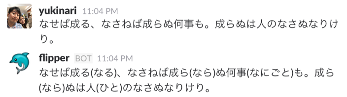

Flipper: Bot interface of Japanese Furigana Engine
==================================================

Example
-------

Installation
------------

- Install MeCab

.. code-block:: bash

    git clone https://github.com/taku910/mecab.git
    cd mecab/mecab
    ./configure
    make && sudo make install

    cd ../mecab-ipa
    ./configure --with-charset=utf8
    make && sudo make install

- Install Flipper

.. code-block:: bash

    git clone git@github.com:yukinarit/flipper.git
    cd flipper
    python setup.py install

- Create a Slack bot user and its API token
https://api.slack.com/bot-users

- Run flipper

.. code-block:: bash

   export FLIPPER_BOT_TOKEN=YOUR_BOT_TOKEN
   export FLIPPER_BOT_ID=`python scripts/print_bot_id.py`
   export LD_LIBRARY_PATH=YOUR_MECAB_INSTALLATION_DIR
   flipper

Tests
-----

.. code-block:: bash

    $ py.test

License
-------
Copyright (c) 2016 Yukinari Tani

Permission is hereby granted, free of charge, to any person obtaining a
copy of this software and associated documentation files (the "Software"),
to deal in the Software without restriction, including without limitation
the rights to use, copy, modify, merge, publish, distribute, sublicense,
and/or sell copies of the Software, and to permit persons to whom the
Software is furnished to do so, subject to the following conditions:

The above copyright notice and this permission notice shall be included in
all copies or substantial portions of the Software.

THE SOFTWARE IS PROVIDED "AS IS", WITHOUT WARRANTY OF ANY KIND, EXPRESS
OR IMPLIED, INCLUDING BUT NOT LIMITED TO THE WARRANTIES OF MERCHANTABILITY,
FITNESS FOR A PARTICULAR PURPOSE AND NONINFRINGEMENT. IN NO EVENT SHALL THE
AUTHORS OR COPYRIGHT HOLDERS BE LIABLE FOR ANY CLAIM, DAMAGES OR OTHER
LIABILITY, WHETHER IN AN ACTION OF CONTRACT, TORT OR OTHERWISE, ARISING
FROM, OUT OF OR IN CONNECTION WITH THE SOFTWARE OR THE USE OR OTHER
DEALINGS IN THE SOFTWARE.
